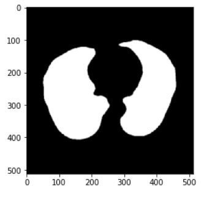

# Image Segmentation tracked/ deployed with mlflow

In this file the same task from the parent folder is performed using the [same](../lungs_incp_unet_snapshot.ipynb) model with the addition of mlflow workflow.

[mlflow](https://mlflow.org/) is an open source platform to manage the machine learning lifecycles. Using mlflow one can track the model accuracies/ parameters during training and also save the model. The mlfow projects allows the machine learning code to be reused in any other system just by running the mlflow command. The model saved by the mlflow package can be easily used as an independent entity across different languages, without the need of installing any of the paskages used to train the model.

## Packages used

keras, sklearn, tensorlfow, tenosrboard, numpy, pandas, cv2, matplotlib, mlflow

## Dataset

For showing comparison study in the task of Image Segmentation, a dataset where we need to segment lesions from the CT scans of lungs. 

There are total 267 CT scans of lungs corresponding with the manually labelled segmented masks.

  

[Here](https://www.kaggle.com/kmader/finding-lungs-in-ct-data/home) is the link to the dataset.

## Usage

Make sure you have the above mentioned packages installed in your environment and you have dowloaded and extracted the dataset at Image_Segmentation folder.

Download the reposritory, and in a cmd prompt navigate to the folder Image_Segmentation folder and run:

`mlflow run seg_mlflow --no-conda`

`--no-conda` option is given if you want to run the project in your existing environment. If you want to create a new environment omit this option.

For viewing the mlflow ui open another cmd prompt and navigate to the folder semantic-segmentation and run:

`mlflow ui`

*Note For running Mlflow ui in windows go to the last comment in the link-> https://github.com/mlflow/mlflow/issues/154 

For viewing Tensorboard ui open a cmd prompt and run:

`tensorboard --logdir="PATH\TO\LOGS"`

For passing parameters to the programs run cmd:

`mlflow run seg_mlflow --no-conda -P PARAM_NAME_1=PARAM_VALUE_1 -P PARAM_NAME_2=PARAM_VALUE_2`

Here are the available parameters:

    --image_path TEXT       Path to images folder
    --annotation_path TEXT  Path to annotations folder
    --weights_path TEXT     Path to base model weights file
    --log_dir TEXT          Path to store log files
    --initial_lr FLOAT      Initial learning rate
    --batch_size INTEGER    Batch size for training
    --seed INTEGER          numpy random seed

## Folder Structure

    Image_Segmentation
                      finding-lungs-in-ct-data 
                                              finding-lungs-in-ct-data
                                                                      2d_images
                                                                      2d_masks
                      seg_mlflow
                      weights
                      logs
